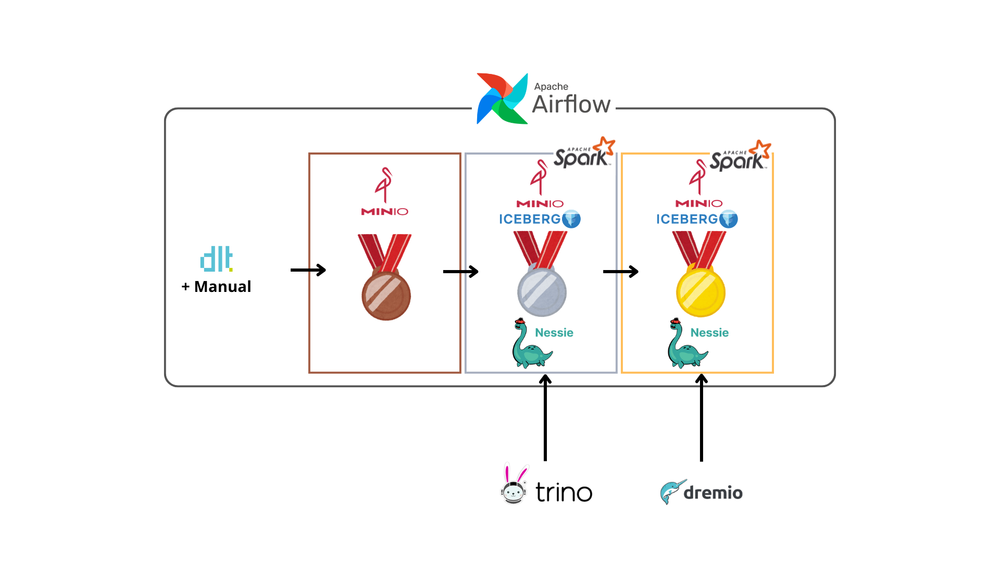

# Data Stack Framework - Lakehouse Architecture with Medallion

This project implements a complete Lakehouse architecture using the Medallion structure (Bronze → Silver → Gold) with open source tools for data ingestion, processing, orchestration, and querying of Stack Overflow data.



## 🔄 Data Flow Overview

1. **Ingestion (Bronze)**: DLT downloads data from Stack Overflow S3 → MinIO Bronze
2. **Transformation (Silver)**: Spark processes Bronze data → Iceberg Silver + Nessie
3. **Aggregation (Gold)**: Spark generates analytical tables → Iceberg Gold + Nessie
4. **Query**: Trino/Dremio query Silver/Gold data via Nessie

## 📊 Stack Overflow Dataset

This project uses the public Stack Overflow dataset provided by ClickHouse, which contains real data from the world's most popular Q&A platform.

### Data Source
- **URL**: https://clickhouse.com/docs/getting-started/example-datasets/stackoverflow
- **Format**: Parquet

## 🏗️ Medallion Architecture

The project implements the Medallion architecture with three data layers:

```
Bronze Layer (Raw Data)
├── Raw data in Parquet format
├── Overwrite allowed
├── Source: StackOverflow Dataset
└── Contains annual data

Silver Layer (Curated Data)
├── Iceberg tables with MERGE writes
├── Curated, normalized and historical data
├── Includes fecha_cargue/load_date column
└── Deduplication and data cleaning

Gold Layer (Analytics Ready)
├── Iceberg tables with MERGE writes
├── Metrics and aggregations
├── Includes fecha_cargue/load_date column
└── Data optimized for analysis
```

## 🚀 Pipeline Versions

### Full Pipeline
**Location**: `full-pipeline/`

**Characteristics**:
- **Period**: 2019-2020 (complete data)
- **Data**: All 7 tables (posts, votes, comments, users, badges, postlinks, posthistory)
- **Bronze**: Automatic ingestion with DLT for all tables
- **Silver**: Processing of all tables with MERGE
- **Gold**: 
  - 5 complete metric tables:
    - `post_counts_by_user`: Count of questions and answers per user
    - `vote_stats_per_post`: Vote statistics per post
    - `top_tags`: Most popular tags
    - `user_engagement`: User engagement metrics (posts, comments, votes, badges)
    - `badges_summary`: Badge summary per user

**Tables Used**:
| Table | 2019 | 2020 | Description |
|-------|------|------|-------------|
| **posts** | 2.7 GB | 2.9 GB | Stack Overflow questions and answers |
| **votes** | 172 MB | 176 MB | Community voting system |
| **comments** | 792 MB | 794 MB | Comments on posts |
| **posthistory** | 4.9 GB | 5.3 GB | Post change history |
| **users** | 1.3 GB | 1.3 GB | Registered user information (no year) |
| **badges** | 760 MB | 760 MB | Badge and achievement system (no year) |
| **postlinks** | 124 MB | 124 MB | Links between related posts (no year) |

### Light Pipeline
**Location**: `light-pipeline/`

**Characteristics**:
- **Period**: 2020-2021 (specific data)
- **Data**: Only posts and votes
- **Bronze**: 
  - 1 table with DLT: `votes 2021` (157 MB)
  - 2 manual tables: `posts 2020` (2.9 GB) and `posts 2021` (2.4 GB)
- **Silver**: 
  - Only historical tables needed for Gold
  - Data from 2020 and 2021 for posts and votes
  - MERGE logic by year
- **Gold**: 
  - 4 metric tables for 2021 data:
    - `post_counts_by_user`: Count of questions and answers per user
    - `top_tags`: Most popular tags
    - `user_engagement`: User engagement metrics (posts and votes)
    - `trending_topics_by_month`: Most popular topics by month

**Tables Used**:
| Table | 2020 | 2021 | Description |
|-------|------|------|-------------|
| **posts** | 2.9 GB | 2.4 GB | Stack Overflow questions and answers |
| **votes** | 176 MB | 157 MB | Community voting system |

## 🛠️ Technologies Used

- **Apache Spark (PySpark)**: Distributed processing engine
- **Apache Airflow**: Workflow orchestrator with DAGs
- **DLT (Data Load Tool)**: Data ingestion from external sources
- **Apache Iceberg**: Table format for Lakehouse
- **Nessie**: Metadata catalog and data versioning
- **MinIO**: S3-compatible storage
- **Trino**: SQL query engine for Silver layer
- **Dremio**: Analytics platform for Gold layer

## 🚀 Quick Start

### 1. Choose Version

```bash
# For complete analysis (recommended for production)
cd full-pipeline

# For faster analysis (simplified version)
cd light-pipeline
```

### 2. Start Infrastructure

```bash
docker compose up -d
```

### 3. Configure Services

1. **MinIO**: http://localhost:9001 (admin/password)
2. **Airflow**: http://localhost:8080 (admin/admin)
3. **Dremio**: http://localhost:9047
4. **Trino**: http://localhost:8081

Each pipeline's README contains a more complete tutorial.

### 4. Execute Pipeline

1. Go to Airflow: http://localhost:8080
2. Activate the DAG `spark_load_to_iceberg`
3. Execute manually

## 📁 Project Structure

```
frameworks/
├── full-pipeline/          # Complete pipeline version
│   ├── dags/               # Airflow DAGs
│   ├── jobs/               # Processing scripts
│   ├── dlt/                # DLT configuration
│   ├── docker-compose.yaml # Service configuration
│   └── README.md           # Complete documentation
├── light-pipeline/         # Lightweight pipeline version
│   ├── dags/               # Airflow DAGs
│   ├── jobs/               # Processing scripts
│   ├── dlt/                # DLT configuration
│   ├── docker-compose.yaml # Service configuration
│   └── README.md           # Light documentation
└── README.md               # This file
```

## 🔧 Services and Ports

| Service | Port | URL | Description |
|---------|------|-----|-------------|
| Airflow Web UI | 8080 | http://localhost:8080 | Orchestration |
| Spark Master UI | 9090 | http://localhost:9090 | Spark monitoring |
| MinIO Console | 9001 | http://localhost:9001 | Storage management |
| MinIO API | 9000 | http://localhost:9000 | S3-compatible API |
| Dremio | 9047 | http://localhost:9047 | Gold layer query engine |
| Trino | 8081 | http://localhost:8081 | Silver layer query engine |
| Nessie | 19120 | http://localhost:19120 | Metadata catalog |
